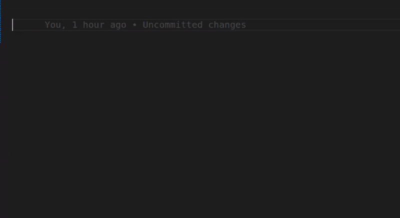

# ⚡ New Next.js 15 Snippets

Supercharge your productivity when building **Next.js 15** apps using these clean, modern code snippets for **App Router**, **Client & Server Components**, **Server Actions**, **API Handlers**, and more.

---

## 📸 Demo

---

## 💡 Snippet Cheat Sheet

Snippets are grouped for clarity:

### 📦 Component Snippets

| Prefix          | Description                                          |
|-----------------|------------------------------------------------------|
| `next-client`   | Create a Client Component with `'use client'`        |
| `next-server`   | Create a Server Component (async/await)              |
| `next-page`     | Generate a basic `page.tsx` component                |
| `next-layout`   | Generate a basic `layout.tsx` root layout            |
| `next-loading`  | Create a `loading.tsx` file for suspense fallback    |
| `next-error`    | Create an `error.tsx` file for client error handling |
| `next-notfound` | Create a `not-found.tsx` page                        |

---

### 🔁 Server Logic Snippets

| Prefix          | Description                                          |
|-----------------|------------------------------------------------------|
| `next-action`   | Create a Server Action (`'use server'`)              |
| `next-handler`  | Create Route Handlers (`GET`, `POST`) for API routes |
| `next-middleware` | Create Middleware with route matchers              |
| `next-metadata` | Export `metadata` for pages/layouts (TS)             |
| `next-revalidate` | Export `revalidate` for ISR                        |
| `next-redirect` | Utilities for `redirect()` / `notFound()`            |
| `next-segment`  | Export `dynamic`, `revalidate`, `fetchCache`, etc.   |
| `next-generate-metadata` | `generateMetadata()` function               |
| `next-generate-params`   | `generateStaticParams()` for dynamic routes |
| `next-server-utils`      | `revalidatePath/Tag`, `cookies`, `headers`  |

---

### 🌐 Navigation Hooks (Client Only)

| Prefix               | Description                                       |
|----------------------|---------------------------------------------------|
| `next-router`        | Use `useRouter()` for navigation                  |
| `next-pathname`      | Use `usePathname()` to get current path           |
| `next-searchparams`  | Use `useSearchParams()` to read query parameters  |
| `next-params`        | Use `useParams()` to read dynamic route params    |
| `next-layoutsegments`| Use `useSelectedLayoutSegments()` for nesting     |
| `next-layoutsegment` | Use `useSelectedLayoutSegment()` for one segment  |

---

### 🧩 UI Components

| Prefix         | Description                                |
|----------------|--------------------------------------------|
| `next-link`    | Import and use Next.js `Link`               |
| `next-image`   | Import and use optimized `Image`            |
| `next-dynamic` | Use `dynamic()` for client-only components  |
| `next-script`  | Use `Script` with loading strategies        |
| `next-og-image`| Create an OG image route (edge)            |

---

---

## 🚀 Features

- ✨ Built specifically for **Next.js 15 App Router**
- 💡 Covers both **Client** and **Server** Components
- 🧠 Helpers for routing, metadata, ISR, and middleware
- 🔁 Snippets include correct imports and `'use client'` where needed
- ✅ Supports both **TypeScript** and **JavaScript** (React/TSX/JSX/TS/JS)
- ⚡ Minimal, fast, and dev-friendly

---

## 🔮 About the Creator

Made with ❤️ by [Hareesh Bhittam](https://github.com/Hareesh108)  
Follow for more dev wizardry 🧙‍♂️✨

---

## 📜 License

MIT License

⭐ If you love this extension, please give it a **star** and share it with your fellow React & Next.js developers!

---
